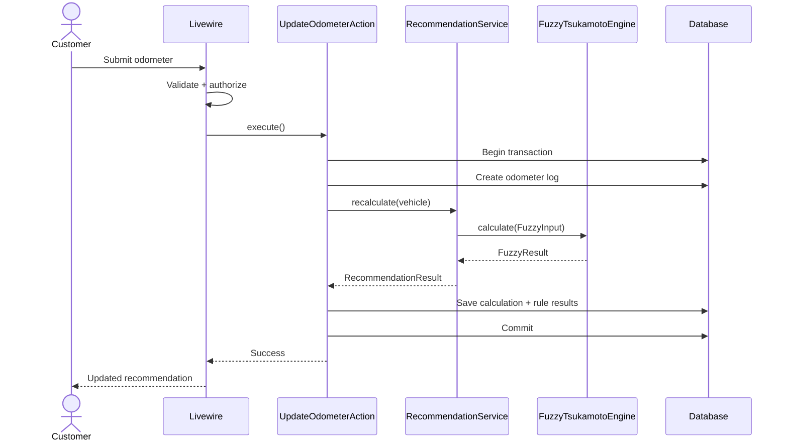
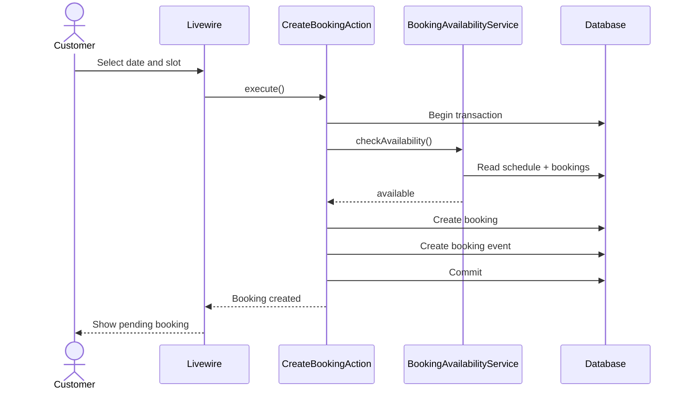
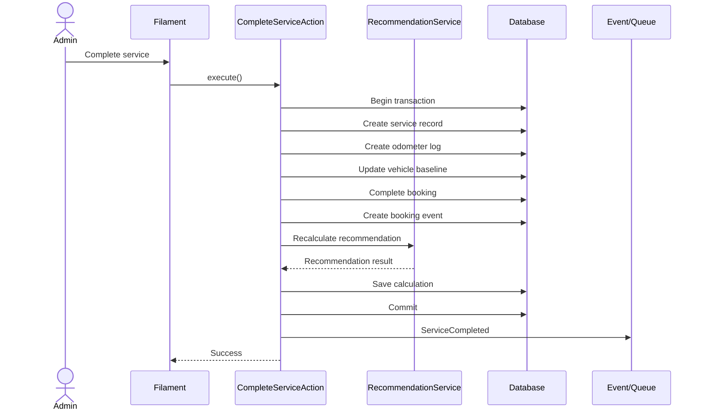

# Architecture Specification

## Sistem Informasi Bengkel & Penjadwalan Servis Rutin dengan Fuzzy Tsukamoto

**Document Version:** 1.1  
**Status:** Locked Baseline  
**Architecture Style:** Modular Monolith  
**Backend Framework:** Laravel  
**Database:** MySQL  
**Customer UI:** Livewire + Blade + Tailwind CSS  
**Admin UI:** Filament  
**Related Documents:**  
- `PRD.md`
- `DATABASE.md`

---

# 1. Tujuan Dokumen

Dokumen ini mendefinisikan arsitektur aplikasi untuk Sistem Informasi Bengkel dan Penjadwalan Servis Rutin dengan Fuzzy Tsukamoto.

Arsitektur dirancang agar:

- cukup sederhana untuk project tugas akhir,
- mudah dipahami oleh pemilik project saat demo dan sidang,
- tidak overengineered,
- mudah diuji,
- business logic tidak bercampur dengan UI,
- fuzzy calculation dapat dijelaskan dan diuji secara independen,
- workflow booking dan servis tetap konsisten,
- mudah dikembangkan dengan Laravel conventions.

---

# 2. Architecture Principles

Project menggunakan prinsip:

1. **Single Laravel Application**
2. **Modular Monolith**
3. **Server-rendered Customer UI**
4. **Filament untuk Admin**
5. **Thin UI Layer**
6. **Business Logic di Actions dan Services**
7. **Pure Fuzzy Engine**
8. **Database sebagai Source of Truth**
9. **Explicit Transactions untuk Critical Workflow**
10. **Event hanya untuk side effect**
11. **Queue hanya untuk asynchronous task**
12. **No unnecessary abstraction**

---

# 3. Tech Stack

| Layer | Technology |
|---|---|
| Backend | Laravel |
| Language | PHP |
| Database | MySQL |
| ORM | Eloquent |
| Customer UI | Livewire + Blade |
| Admin UI | Filament |
| Styling | Tailwind CSS |
| Client Interaction | Alpine.js |
| Asset Build | Vite |
| Authentication | Laravel Auth |
| Authorization | Laravel Policies |
| Queue | Laravel Database Queue |
| Scheduler | Laravel Scheduler |
| Notification | Laravel Notifications |
| Email Dev | Mailpit |
| Testing | Pest |
| Logging | Laravel Logging |
| Containerization | Docker + Docker Compose |
| Web Server | Nginx |
| Deployment | Dockerized Laravel app + Nginx + MySQL + Queue Worker + Scheduler |

Tidak menggunakan:

- React,
- Vue SPA,
- separate REST API untuk frontend internal,
- microservices,
- Redis sebagai requirement utama,
- Python service untuk fuzzy,
- GraphQL,
- event sourcing,
- repository pattern generik,
- CQRS.

---

# 4. High-Level Architecture

```text
                              Browser
                                 │
                                 ▼
                    ┌─────────────────────────┐
                    │   Docker Runtime Host   │
                    │                         │
                    │        Nginx            │
                    │          │              │
                    │          ▼              │
                    │   Laravel Application   │
                    │   ┌────────┬────────┐   │
                    │   │        │        │   │
                    │ Customer  Admin   Domain│
                    │ Livewire Filament Services
                    │          │              │
                    │       Eloquent          │
                    │          │              │
                    │          ▼              │
                    │        MySQL            │
                    │                         │
                    │ Queue Worker  Scheduler │
                    └─────────────────────────┘
```

Pada level aplikasi, customer dan admin tetap memakai satu Laravel modular monolith. Docker hanya menjadi **runtime dan deployment boundary**, bukan pemisahan domain atau microservice.

---

# 5. Request Flow

General request lifecycle:

```text
HTTP Request / Livewire Action / Filament Action
                 ↓
             Validation
                 ↓
            Authorization
                 ↓
          Application Action
                 ↓
           Domain Services
                 ↓
          Eloquent / Database
                 ↓
            Domain Result
                 ↓
             UI Response
```

UI tidak boleh memiliki business logic besar.

---

# 6. Application Layers

## 6.1 Presentation Layer

Presentation hanya bertanggung jawab pada:

- menerima input,
- menampilkan data,
- validation feedback,
- memanggil action/service,
- interaction state,
- loading state,
- error state.

Presentation terdiri dari:

### Customer

```text
Livewire
Blade
Tailwind CSS
Alpine.js
```

### Admin

```text
Filament Resources
Filament Pages
Filament Widgets
Filament Actions
```

Presentation tidak melakukan:

- fuzzy formula,
- booking capacity calculation,
- service completion transaction,
- state transition validation,
- recommendation projection.

---

## 6.2 Application Layer

Application layer direpresentasikan oleh **Action Classes**.

Action menjawab:

> Apa yang harus dilakukan sistem ketika sebuah business operation dijalankan?

Contoh:

```text
CreateVehicleAction
UpdateVehicleAction
UpdateOdometerAction

CreateBookingAction
ConfirmBookingAction
RescheduleBookingAction
CancelBookingAction
StartServiceAction

CompleteServiceAction

ActivateFuzzyConfigAction
```

Action boleh:

- membuka DB transaction,
- memanggil beberapa domain service,
- menyimpan model,
- membuat event,
- mengembalikan result.

Action tidak seharusnya berisi rumus fuzzy detail.

---

## 6.3 Domain Layer

Berisi logic utama bisnis.

Contoh domain:

```text
Vehicle
Recommendation
Fuzzy
Booking
Service
Workshop Scheduling
Notification
Reporting
```

Domain service harus fokus pada satu tanggung jawab.

---

## 6.4 Persistence Layer

Menggunakan Eloquent Models.

Model bertanggung jawab pada:

- relationships,
- casts,
- scopes,
- simple derived attributes.

Model tidak bertanggung jawab pada orchestration workflow besar.

---

# 7. Recommended Folder Structure

```text
app/
│
├── Actions/
│   ├── Vehicle/
│   │   ├── CreateVehicleAction.php
│   │   ├── UpdateVehicleAction.php
│   │   └── UpdateOdometerAction.php
│   │
│   ├── Booking/
│   │   ├── CreateBookingAction.php
│   │   ├── ConfirmBookingAction.php
│   │   ├── RescheduleBookingAction.php
│   │   ├── CancelBookingAction.php
│   │   └── StartServiceAction.php
│   │
│   ├── Service/
│   │   └── CompleteServiceAction.php
│   │
│   └── Fuzzy/
│       └── ActivateFuzzyConfigAction.php
│
├── DTOs/
│   ├── Fuzzy/
│   │   ├── FuzzyInput.php
│   │   ├── MembershipResult.php
│   │   ├── RuleResult.php
│   │   └── FuzzyResult.php
│   │
│   └── Recommendation/
│       └── RecommendationResult.php
│
├── Enums/
│   ├── UserRole.php
│   ├── BookingStatus.php
│   ├── BookingEventType.php
│   ├── OdometerSource.php
│   ├── BaselineSource.php
│   ├── RecommendationStatus.php
│   └── CalculationTrigger.php
│
├── Events/
│   ├── RecommendationStatusChanged.php
│   ├── BookingCreated.php
│   ├── BookingConfirmed.php
│   ├── BookingRescheduled.php
│   └── ServiceCompleted.php
│
├── Filament/
│   ├── Resources/
│   ├── Pages/
│   └── Widgets/
│
├── Livewire/
│   ├── Dashboard/
│   ├── Vehicles/
│   ├── Recommendations/
│   ├── Bookings/
│   ├── ServiceHistory/
│   ├── Notifications/
│   └── Profile/
│
├── Models/
│
├── Notifications/
│
├── Policies/
│
├── Services/
│   ├── Fuzzy/
│   │   ├── FuzzyTsukamotoEngine.php
│   │   ├── MembershipCalculator.php
│   │   ├── RuleEvaluator.php
│   │   ├── Defuzzifier.php
│   │   └── FuzzyConfigResolver.php
│   │
│   ├── Recommendation/
│   │   ├── RecommendationService.php
│   │   ├── ProgressCalculator.php
│   │   ├── UsageCalculator.php
│   │   ├── ServiceDueDateCalculator.php
│   │   └── RecommendationGuard.php
│   │
│   ├── Booking/
│   │   ├── BookingAvailabilityService.php
│   │   └── BookingTransitionService.php
│   │
│   ├── Workshop/
│   │   └── WorkshopScheduleService.php
│   │
│   └── Reporting/
│       └── ReportService.php
│
├── Jobs/
│
├── Console/
│   └── Commands/
│
└── Support/
```

Struktur dapat sedikit berubah mengikuti konvensi Laravel/Filament versi yang digunakan, tetapi tanggung jawab layer harus tetap sama.

---

# 8. Customer Application Architecture

Customer area menggunakan Livewire.

Contoh route:

```text
/
 /login
 /register

/dashboard

/vehicles
/vehicles/create
/vehicles/{vehicle}
/vehicles/{vehicle}/edit

/recommendations
/recommendations/{vehicle}
/recommendations/{vehicle}/calculation/{calculation}

/bookings
/bookings/create
/bookings/{booking}

/service-history
/service-history/{record}

/notifications
/profile
```

Livewire component bertanggung jawab pada UI dan memanggil Actions/Services.

Contoh:

```text
UpdateOdometer Component
        ↓
UpdateOdometerAction
        ↓
RecommendationService
```

Bukan:

```text
UpdateOdometer Component
        ↓
langsung berisi rumus fuzzy + notification + insert booking
```

---

# 9. Admin Application Architecture

Admin menggunakan Filament pada:

```text
/admin
```

Admin panel resources:

```text
BookingResource
CustomerResource
VehicleResource
ServiceRecordResource
ServiceProfileResource
FuzzyConfigResource
WorkshopSettingResource
ScheduleExceptionResource
```

Custom pages:

```text
Admin Dashboard
Reports
Fuzzy Rules Viewer
Workshop Schedule
```

Filament bertanggung jawab pada UI administrasi, tetapi business operation tetap diarahkan ke Action/Service.

Contoh:

```text
Filament Booking Action: Confirm
        ↓
ConfirmBookingAction
```

bukan update status langsung dari resource.

---

# 10. Authentication Architecture

Satu tabel:

```text
users
```

Role:

```text
customer
admin
```

Tidak menggunakan package permission kompleks.

Admin access:

```text
User.role == admin
```

Customer registration hanya membuat:

```text
role = customer
```

Admin dibuat melalui:

- seeder,
- command internal,
- manual controlled administration.

Public registration tidak dapat membuat admin.

---

# 11. Authorization Architecture

Gunakan Laravel Policies.

Minimum:

```text
VehiclePolicy
BookingPolicy
ServiceRecordPolicy
FuzzyCalculationPolicy
```

Customer hanya dapat melihat/mengubah resource yang dimilikinya.

Ownership chain:

```text
Booking
→ Vehicle
→ User
```

dan:

```text
ServiceRecord
→ Vehicle
→ User
```

Jangan mengandalkan URL secrecy sebagai security.

---

# 12. Vehicle Domain

Vehicle domain menyimpan:

- identity,
- ownership,
- active service profile,
- current baseline service.

Core services/actions:

```text
CreateVehicleAction
UpdateVehicleAction
UpdateOdometerAction
```

Vehicle creation flow:

```text
Validate
  ↓
Authorize
  ↓
Create Vehicle
  ↓
Create Initial Odometer Log
  ↓
If baseline available
  ↓
Calculate Recommendation
```

---

# 13. Odometer Architecture

Odometer history adalah source of truth untuk mileage.

Setiap update menghasilkan:

```text
odometer_logs
```

Tidak menggunakan satu mutable field `current_odometer` sebagai satu-satunya source.

Flow:

```text
Customer input
    ↓
Validate >= latest odometer
    ↓
Create OdometerLog
    ↓
Recommendation recalculation
```

Admin correction harus meninggalkan audit trail.

---

# 14. Fuzzy Architecture

Fuzzy adalah domain paling penting pada project.

Architecture:

```text
FuzzyTsukamotoEngine
    │
    ├── MembershipCalculator
    ├── RuleEvaluator
    └── Defuzzifier
```

Engine harus dapat berjalan tanpa database.

Contoh:

```text
FuzzyInput
    ↓
FuzzyTsukamotoEngine
    ↓
FuzzyResult
```

---

# 15. Fuzzy Input DTO

```text
FuzzyInput
```

berisi:

```text
progressKm
progressTime
usageIntensity
```

Tidak menerima Eloquent model secara langsung.

Tujuannya:

- pure calculation,
- mudah unit test,
- tidak bergantung database,
- deterministic.

---

# 16. MembershipCalculator

Tanggung jawab:

```text
progressKm
→ safe
→ approaching
→ critical

progressTime
→ safe
→ approaching
→ critical

usageIntensity
→ normal
→ intensive
```

Output contoh:

```text
km:
safe        = 0.20
approaching = 0.80
critical    = 0.00
```

Calculator tidak boleh:

- query database,
- save model,
- mengirim notification.

---

# 17. RuleEvaluator

Input:

```text
MembershipResult
+
Canonical Fuzzy Rules
```

Output:

```text
RuleResult[]
```

Setiap rule result:

```text
rule
alpha
zValue
weightedValue
```

Alpha:

```text
MIN(membership antecedents)
```

Rule dengan alpha 0 dapat dilewati dari persistence.

---

# 18. Defuzzifier

Defuzzifier hanya menjalankan:

```text
Σ(alpha × z)
──────────────
   Σ alpha
```

Output:

```text
score 0–100
```

Tidak menentukan:

- service date,
- booking date,
- final recommendation guard.

---

# 19. Recommendation Architecture

Fuzzy bukan keseluruhan recommendation.

Architecture:

```text
RecommendationService
        │
        ├── ProgressCalculator
        ├── UsageCalculator
        ├── FuzzyConfigResolver
        ├── FuzzyTsukamotoEngine
        ├── ServiceDueDateCalculator
        └── RecommendationGuard
```

---

# 20. ProgressCalculator

Menghitung:

```text
km_since_service
progress_km

days_since_service
progress_time
```

Rumus dasar:

```text
progress_km =
km_since_service / interval_km × 100

progress_time =
days_since_service / interval_days × 100
```

---

# 21. UsageCalculator

Menghitung:

```text
average_daily_km
baseline_daily_usage
usage_intensity
```

Rumus:

```text
baseline_daily_usage =
interval_km / interval_days

usage_intensity =
average_daily_km / baseline_daily_usage × 100
```

Jika histori belum cukup, service harus mengembalikan state yang jelas dan menggunakan fallback yang telah ditentukan pada implementation, bukan random value.

---

# 22. FuzzyConfigResolver

Bertanggung jawab mengambil active fuzzy configuration.

Engine tidak query config sendiri.

Flow:

```text
RecommendationService
        ↓
FuzzyConfigResolver
        ↓
FuzzyConfig
        ↓
FuzzyTsukamotoEngine
```

---

# 23. ServiceDueDateCalculator

Bertanggung jawab pada projection:

```text
estimated_due_by_km
estimated_due_by_time
estimated_due_date
recommended_date
```

Contoh:

```text
remaining_km = 500
average_daily_km = 35

estimated days ≈ 14
```

Kemudian dibandingkan dengan batas waktu.

---

# 24. RecommendationGuard

Tujuan:

mencegah recommendation final bertentangan dengan proyeksi servis aktual.

Contoh:

```text
fuzzy_score = 68
fuzzy_status = approaching

estimated_due_days = 5
```

Final:

```text
final_status = urgent
guard_applied = true
```

Important:

```text
fuzzy score TIDAK diubah
```

Guard hanya bekerja pada final recommendation layer.

---

# 25. Recommendation Persistence

Setelah calculation:

```text
Create FuzzyCalculation
Create active FuzzyRuleResults
```

Current recommendation:

```text
latest FuzzyCalculation for Vehicle
```

Tidak ada tabel recommendation terpisah.

---

# 26. Recommendation Recalculation Triggers

Kalkulasi dilakukan saat:

```text
vehicle created with complete baseline
odometer updated
service completed
service profile changed
fuzzy config changed
daily scheduler
manual recalculation
```

Tidak dihitung ulang setiap page refresh.

---

# 27. Booking Architecture

Core services:

```text
BookingAvailabilityService
BookingTransitionService
```

Core actions:

```text
CreateBookingAction
ConfirmBookingAction
RescheduleBookingAction
CancelBookingAction
StartServiceAction
```

---

# 28. BookingAvailabilityService

Input:

```text
date
time
```

Reads:

```text
workshop_settings
operating_hours
schedule_exceptions
existing bookings
```

Output:

```text
available
remainingCapacity
```

Slot dibuat secara dinamis.

Tidak ada `booking_slots` table.

---

# 29. Booking Creation Flow

```text
Livewire Booking Form
        ↓
Validation
        ↓
Authorization
        ↓
CreateBookingAction
        ↓
DB Transaction
        ↓
Re-check availability
        ↓
Re-check capacity
        ↓
Create Booking
        ↓
Create BookingEvent(created)
        ↓
Commit
```

Server tidak mempercayai availability UI sebelumnya.

---

# 30. Booking State Machine

Enum:

```text
Pending
Confirmed
InService
Completed
Cancelled
```

Valid transitions:

```text
Pending
├── Confirmed
└── Cancelled

Confirmed
├── InService
└── Cancelled

InService
└── Completed
```

Invalid transition harus ditolak di backend.

Tidak menggunakan state machine package untuk MVP.

---

# 31. Booking Events

Setiap perubahan penting membuat:

```text
booking_events
```

Contoh:

```text
created
confirmed
rescheduled
started
completed
cancelled
```

Timeline customer/admin berasal dari tabel ini.

---

# 32. Service Architecture

Core action:

```text
CompleteServiceAction
```

Service completion adalah critical transaction.

---

# 33. Complete Service Flow

```text
Admin
  ↓
CompleteServiceAction
  ↓
BEGIN TRANSACTION

Validate booking state
Validate odometer

Create ServiceRecord
Create OdometerLog(source=service)

Update Vehicle Baseline:
    service date
    service odometer
    baseline source
    service record reference

Update Booking = completed
Create BookingEvent(completed)

Calculate new recommendation
Persist FuzzyCalculation
Persist FuzzyRuleResults

COMMIT
  ↓
ServiceCompleted Event
  ↓
Notifications / Email
```

Jika satu langkah gagal:

```text
ROLLBACK
```

---

# 34. Workshop Scheduling Architecture

Service:

```text
WorkshopScheduleService
```

Reads:

```text
workshop_settings
operating_hours
schedule_exceptions
```

Tanggung jawab:

- menentukan bengkel buka/tutup,
- menghasilkan slot waktu,
- menangani tanggal libur,
- menangani jam khusus,
- menyediakan data ke booking availability.

---

# 35. Notification Architecture

Gunakan Laravel Notifications.

Channels:

```text
database
mail
```

Notifications:

```text
ServiceApproachingNotification
ServiceUrgentNotification
BookingConfirmedNotification
BookingRescheduledNotification
UpcomingBookingNotification
ServiceCompletedNotification
```

Notification bisnis dikirim setelah database transaction berhasil.

---

# 36. Events vs Direct Calls

Event digunakan hanya untuk side effect yang dapat dipisahkan.

Contoh event:

```text
RecommendationStatusChanged
BookingCreated
BookingConfirmed
BookingRescheduled
ServiceCompleted
```

Contoh side effect:

```text
send database notification
send email
queue reminder
```

Core consistency operation tidak dipisahkan menjadi event.

Contoh yang tetap berada dalam `CompleteServiceAction`:

```text
create service record
update vehicle baseline
update booking
create fuzzy calculation
```

---

# 37. Queue Architecture

Queue driver:

```text
database
```

Digunakan untuk:

- email,
- asynchronous notification,
- background recalculation bila dibutuhkan.

Worker:

```text
php artisan queue:work
```

Redis tidak menjadi requirement MVP.

---

# 38. Scheduler Architecture

Laravel Scheduler menangani task periodik.

Recommended schedule:

```text
Daily Recommendation Recalculation
Service Reminder
Booking H-1 Reminder
```

Konsep:

```text
Cron
  ↓
Laravel Scheduler
  ↓
Command
  ↓
Jobs / Services
```

Business logic tidak ditulis langsung di scheduler definition.

---

# 39. Scheduled Recommendation Strategy

Waktu terus berubah meskipun customer tidak membuka aplikasi.

Karena itu setiap vehicle aktif dengan baseline lengkap dapat dihitung ulang satu kali per hari.

Tujuan:

- progress time tetap aktual,
- status dapat berubah otomatis,
- reminder bisa dipicu.

Batasi:

```text
maximum one daily scheduled calculation per vehicle per day
```

---

# 40. Notification Deduplication

Customer tidak boleh menerima reminder yang sama setiap hari.

Trigger utama:

```text
NotNeeded → Approaching
Approaching → Urgent
```

dan event tertentu:

```text
recommended date approaching
booking H-1
booking confirmed
service completed
```

Sistem harus memeriksa previous status sebelum mengirim status-change notification.

---

# 41. Reporting Architecture

Report bukan CRUD resource.

Gunakan:

```text
ReportService
```

Input:

```text
date range
optional filters
```

Reads:

```text
bookings
service_records
vehicles
users
```

Output:

```text
total booking
completed service
revenue
unique customer
transaction list
```

Admin presentation:

```text
Filament Custom Page
```

Tidak ada `reports` table.

---

# 42. DTO Strategy

DTO digunakan hanya ketika struktur data domain memang bernilai.

Minimum:

```text
FuzzyInput
MembershipResult
RuleResult
FuzzyResult
RecommendationResult
```

Jangan membuat DTO untuk semua CRUD sederhana.

Tujuannya bukan abstraction sebanyak mungkin, tetapi membuat boundary fuzzy/recommendation jelas.

---

# 43. Enum Strategy

Native PHP Enum digunakan untuk value yang terbatas.

Minimum:

```text
UserRole
BookingStatus
BookingEventType
OdometerSource
BaselineSource
RecommendationStatus
CalculationTrigger
```

Dilarang menyebarkan magic string di seluruh codebase.

---

# 44. Database Transaction Boundaries

Transaction wajib untuk:

### Create Vehicle

Jika melibatkan initial odometer dan initial recommendation.

### Update Odometer

```text
odometer log
+
recommendation calculation
```

### Create Booking

```text
availability check
+
booking
+
booking event
```

### Complete Service

```text
service record
+
odometer
+
vehicle baseline
+
booking state
+
booking event
+
recommendation
```

### Activate Fuzzy Config

```text
deactivate old
+
create/activate new
```

CRUD ringan seperti edit nama kendaraan tidak perlu transaction kompleks.

---

# 45. Error Handling

Business/domain failures menggunakan exception yang jelas.

Contoh:

```text
InvalidOdometerException
BookingSlotUnavailableException
InvalidBookingTransitionException
RecommendationUnavailableException
```

UI menampilkan human-friendly message.

Jangan tampilkan:

```text
SQLSTATE...
```

kepada customer.

---

# 46. Fuzzy Error Policy

Jika fuzzy gagal:

```text
Recommendation unavailable
```

Dilarang fallback ke:

```text
score = 0
```

atau score random.

Error harus:

- dilog,
- dapat diretry,
- tidak menghasilkan recommendation palsu.

---

# 47. Logging

Laravel logging digunakan untuk:

- exception,
- failed jobs,
- fuzzy calculation errors,
- booking availability error,
- email failure.

Business history menggunakan domain history:

```text
booking_events
service_records
fuzzy_calculations
odometer_logs
```

Tidak perlu generic activity log untuk seluruh sistem pada MVP.

---

# 48. Testing Architecture

Framework:

```text
Pest
```

Folder:

```text
tests/
├── Unit/
│   ├── Fuzzy/
│   └── Recommendation/
│
└── Feature/
    ├── Auth/
    ├── Vehicle/
    ├── Booking/
    ├── Service/
    ├── Recommendation/
    └── Admin/
```

---

# 49. Fuzzy Unit Tests

Minimum:

```text
MembershipCalculatorTest
RuleEvaluatorTest
DefuzzifierTest
FuzzyTsukamotoEngineTest
```

Wajib menguji:

- boundaries,
- overlapping memberships,
- score selalu 0–100,
- deterministic output,
- no division by zero,
- correct active rules,
- correct weighted average.

---

# 50. Recommendation Tests

Minimum:

```text
ProgressCalculatorTest
UsageCalculatorTest
ServiceDueDateCalculatorTest
RecommendationGuardTest
```

Scenarios:

```text
safe vehicle
approaching vehicle
critical km
critical time
intensive usage
guard escalation
insufficient usage data
```

---

# 51. Authorization Tests

Wajib:

```text
Customer A cannot see Vehicle B
Customer A cannot update Vehicle B
Customer A cannot see Booking B
Customer A cannot see FuzzyCalculation B
Customer cannot access admin
Admin can access admin resources
```

---

# 52. Booking Tests

Wajib:

```text
available slot succeeds
full slot rejected
closed day rejected
schedule exception respected
cancelled booking releases capacity
invalid state transition rejected
```

---

# 53. Service Completion Tests

Sebelum:

```text
baseline = 10000 km
```

Servis:

```text
13800 km
```

Setelah selesai:

```text
service record exists
odometer log exists
booking = completed
baseline = 13800
new recommendation exists
progress approximately resets
```

Jika satu operasi gagal:

```text
transaction rollback
```

---

# 54. Frontend Architecture

Customer UI menggunakan component reuse secukupnya.

Blade components contoh:

```text
<x-button>
<x-input>
<x-status-badge>
<x-empty-state>
<x-modal>
<x-progress>
<x-page-header>
```

Livewire dipakai untuk stateful workflow.

Alpine.js hanya untuk:

- dropdown,
- simple disclosure,
- modal helper,
- minor client interaction.

Business state tidak boleh hanya hidup di browser.

---

# 55. Design System Integration

Customer UI mengikuti locked theme:

```text
Modern Workshop Editorial
```

Prinsip:

- clean,
- warm-neutral,
- typography-led,
- restrained color,
- minimal shadow,
- no AI-slop,
- no excessive cards,
- no glassmorphism,
- no decorative gradients.

Admin Filament hanya dikustomisasi secukupnya:

- brand,
- font,
- accent,
- radius,
- badge semantics.

Tidak melakukan extreme Filament rewrite.

---

# 56. Security Architecture

Minimum:

- CSRF protection,
- password hashing,
- Laravel session security,
- Policies,
- server-side validation,
- admin panel access control,
- ownership checks,
- no mass assignment vulnerability,
- no sensitive data in logs,
- `.env` excluded from Git,
- database credentials outside source code.

---

# 57. Performance Architecture

Prinsip:

- eager loading,
- pagination,
- indexed queries,
- latest-of-many relationships,
- no fuzzy recalculation on every page refresh,
- queue email,
- date-scoped reporting,
- avoid N+1.

Tidak perlu:

- caching layer kompleks,
- Redis,
- Elasticsearch.

Optimization dilakukan berdasarkan kebutuhan nyata.

---

# 58. Containerization & Docker Architecture

Docker menjadi **canonical development and deployment environment** untuk project.

Tujuan utama:

- setup project di laptop client tanpa menginstal PHP, Composer, MySQL, Nginx, dan Node secara manual,
- environment developer dan client lebih konsisten,
- mengurangi masalah perbedaan versi dependency,
- mempermudah deployment ke VPS/server yang mendukung Docker,
- queue worker dan scheduler dapat dijalankan sebagai container terpisah tetapi tetap menggunakan image aplikasi yang sama.

Arsitektur container:

```text
Docker Compose
│
├── nginx
│     └── reverse proxy / static files
│
├── app
│     └── PHP-FPM + Laravel
│
├── queue
│     └── same application image
│         php artisan queue:work
│
├── scheduler
│     └── same application image
│         php artisan schedule:work
│
├── mysql
│     └── persistent database volume
│
├── node              [development only]
│     └── Vite dev server / frontend build
│
└── mailpit           [development only]
      └── local email testing
```

Prinsip penting:

```text
app
queue
scheduler
```

harus menggunakan **image Laravel yang sama** agar PHP version, extensions, Composer packages, dan source code konsisten.

Tidak membuat image terpisah untuk setiap business module.

---

## 58.1 Recommended Docker Files

Struktur minimum:

```text
project/
├── docker/
│   ├── nginx/
│   │   └── default.conf
│   └── php/
│       └── php.ini
│
├── Dockerfile
├── compose.yaml
├── compose.override.yaml        optional development override
├── .dockerignore
└── .env.example
```

Jika deployment membutuhkan konfigurasi production terpisah, gunakan salah satu pola sederhana:

```text
compose.yaml
compose.prod.yaml
```

atau environment-specific override.

Jangan membuat orchestration kompleks untuk scope project ini.

---

## 58.2 Application Image

`Dockerfile` harus membangun runtime Laravel yang memiliki extension PHP yang dibutuhkan project.

Minimum expected:

```text
pdo_mysql
mbstring
intl
bcmath
pcntl
zip
```

Tambahkan extension lain hanya jika dependency project membutuhkannya.

Composer dependency di-install di image.

Untuk production, frontend asset sebaiknya dibuild melalui **multi-stage Docker build** menggunakan Node, kemudian hasil Vite dipindahkan ke final application image.

Dengan demikian production server tidak membutuhkan Node runtime hanya untuk menjalankan aplikasi.

---

## 58.3 Development Containers

Development environment minimum:

```text
nginx
app
mysql
node
mailpit
```

Queue dan scheduler dapat ikut dijalankan sebagai service agar behavior development mendekati production.

Setup target pada laptop baru:

```bash
docker compose up -d --build
docker compose exec app php artisan migrate --seed
```

Idealnya project menyediakan helper command/script agar first setup dapat dilakukan dengan satu workflow yang singkat.

Client tidak perlu memasang secara native:

```text
PHP
Composer
MySQL
Nginx
Node.js
```

Client cukup memiliki:

```text
Docker Desktop
```

atau:

```text
Docker Engine + Docker Compose
```

---

## 58.4 Persistent Data

MySQL harus menggunakan named volume.

Contoh konsep:

```text
mysql_data
```

Source code boleh bind-mounted pada development.

Production database tidak boleh disimpan hanya di writable layer container karena data akan hilang saat container diganti.

---

## 58.5 Environment & Secrets

Docker tidak mengubah aturan secret management.

Tetap gunakan:

```text
.env
```

untuk runtime configuration.

Rules:

- `.env` tidak masuk Git,
- `.env.example` tersedia,
- production credential berbeda dari development,
- secret tidak ditulis di Dockerfile,
- secret tidak di-hardcode pada `compose.yaml`.

---

## 58.6 Docker Health Checks

Service penting sebaiknya mempunyai health check atau readiness strategy sederhana.

Minimum:

```text
mysql
app/php-fpm
nginx
```

Application startup yang membutuhkan database harus menunggu MySQL siap, bukan hanya container sudah started.

---

## 58.7 Docker Networking

Gunakan internal Docker network.

Service Laravel mengakses database menggunakan service name:

```text
DB_HOST=mysql
```

Bukan:

```text
localhost
```

Browser hanya perlu mengekspos port web application.

MySQL tidak perlu diekspos ke publik pada production.

---

## 58.8 Development vs Production

### Development

Prioritas:

- bind mount source,
- Vite HMR,
- Mailpit,
- debug-friendly configuration,
- optional exposed MySQL port untuk database client lokal.

### Production

Prioritas:

- immutable application image,
- prebuilt frontend assets,
- `APP_ENV=production`,
- `APP_DEBUG=false`,
- no Mailpit,
- no Vite dev server,
- restricted exposed ports,
- persistent MySQL storage,
- queue and scheduler always running.

---

# 59. Deployment Architecture

Canonical deployment menggunakan Docker Compose pada satu VPS/server untuk scope MVP/TA.

```text
Internet
   │
   ▼
Host / VPS
   │
   └── Docker Compose
         │
         ├── Nginx
         │     │
         │     ▼
         │   Laravel / PHP-FPM
         │     │
         │     ▼
         │   MySQL
         │
         ├── Queue Worker
         │     └── Database Queue
         │
         └── Scheduler
               └── Laravel Scheduler

Laravel
   │
   └── SMTP Provider
         └── Email
```

Untuk MVP tidak membutuhkan:

- Kubernetes,
- Docker Swarm,
- service mesh,
- multi-node orchestration.

Satu Docker host sudah cukup.

Jika deployment platform nantinya menyediakan managed MySQL, container `mysql` dapat diganti dengan managed database tanpa mengubah application architecture.

---

## 59.1 Production Container Responsibilities

### `nginx`

- menerima HTTP request,
- serve static asset,
- forward PHP request ke app container.

### `app`

- menjalankan PHP-FPM,
- Laravel application,
- request/response utama.

### `queue`

Menjalankan:

```bash
php artisan queue:work --tries=3
```

Parameter final dapat disesuaikan saat deployment.

### `scheduler`

Menjalankan:

```bash
php artisan schedule:work
```

atau cron host yang menjalankan:

```bash
php artisan schedule:run
```

Untuk portability Docker, dedicated scheduler container menjadi default architecture.

### `mysql`

- persistent data,
- backup strategy,
- tidak public-facing.

---

## 59.2 Deployment Flow

Target deployment flow:

```text
Git pull / CI build
        ↓
Build application image
        ↓
Start/update containers
        ↓
Run migrations
        ↓
Cache production configuration
        ↓
Restart queue worker if required
        ↓
Health check
```

Typical Laravel production commands:

```bash
php artisan migrate --force
php artisan config:cache
php artisan route:cache
php artisan view:cache
```

Gunakan command yang kompatibel dengan implementation final.

---

## 59.3 Database Backup

Sebelum migration production yang berisiko:

```text
backup database
```

Backup MySQL harus disimpan di luar ephemeral container layer.

---

# 60. Environment Configuration

Key environment groups:

```text
APP_*
DB_*
MAIL_*
QUEUE_CONNECTION=database
SESSION_*
CACHE_*
```

Docker-specific development values:

```text
DB_HOST=mysql
MAIL_HOST=mailpit
```

Development:

```text
Docker Compose
MySQL container
Mailpit container
Vite development service
Queue worker container
Scheduler container
```

Production:

```text
Docker Compose / Docker-compatible host
Nginx container
Laravel app container
MySQL container or managed MySQL
Queue worker container
Scheduler container
SMTP provider
```

Environment parity menjadi tujuan utama: source code dan runtime image yang sama digunakan dari development menuju deployment sejauh memungkinkan.

---

# 61. Why Fuzzy Stays in PHP

Fuzzy Tsukamoto hanya membutuhkan:

```text
membership calculation
MIN
rule evaluation
z calculation
weighted average
```

Python service tidak memberikan manfaat untuk scope ini.

Pure PHP memberikan:

- deployment lebih mudah,
- satu codebase,
- unit testing lebih mudah,
- debugging lebih mudah,
- lebih mudah dijelaskan saat sidang.

---

# 62. Sequence — Update Odometer



---

# 63. Sequence — Create Booking



---

# 64. Sequence — Complete Service



---

# 65. Architecture Decisions

## ADR-001 — Modular Monolith

**Decision:** satu Laravel application.

**Reason:**

- scope TA,
- development lebih cepat,
- deployment sederhana,
- tidak ada kebutuhan independent scaling.

---

## ADR-002 — Livewire untuk Customer

**Decision:** customer UI menggunakan Livewire.

**Reason:**

- server-driven,
- cocok untuk form dan CRUD interaktif,
- tidak perlu SPA,
- satu PHP stack.

---

## ADR-003 — Filament untuk Admin

**Decision:** admin menggunakan Filament.

**Reason:**

- cepat untuk operational CRUD,
- resource management,
- dashboard,
- forms,
- tables,
- mengurangi pekerjaan UI admin tanpa mengurangi business logic quality.

---

## ADR-004 — Database Queue

**Decision:** Laravel database queue.

**Reason:**

- MySQL sudah tersedia,
- workload kecil,
- tidak perlu Redis.

---

## ADR-005 — Pure PHP Fuzzy Engine

**Decision:** Fuzzy Tsukamoto diimplementasikan dalam PHP.

**Reason:**

- algorithm sederhana,
- tidak membutuhkan ML stack,
- lebih mudah test,
- lebih mudah deployment.

---

## ADR-006 — Versioned Fuzzy Config

**Decision:** konfigurasi fuzzy versioned.

**Reason:**

- historical calculation tetap reproducible,
- perubahan admin tidak merusak histori penelitian.

---

## ADR-007 — No Recommendation Table

**Decision:** current recommendation berasal dari latest fuzzy calculation.

**Reason:**

- menghindari duplicate source of truth.

---

## ADR-008 — Dynamic Booking Slots

**Decision:** booking slot dihitung dinamis.

**Reason:**

- schedule lebih fleksibel,
- tidak perlu pre-generate ribuan rows.

---

## ADR-009 — Docker as Canonical Runtime

**Decision:** development setup dan canonical deployment menggunakan Docker + Docker Compose.

**Reason:**

- setup laptop client lebih cepat,
- tidak perlu install PHP/MySQL/Composer/Node secara native,
- versi dependency lebih konsisten,
- queue dan scheduler mempunyai runtime yang repeatable,
- deployment ke Docker-compatible VPS lebih mudah,
- environment development dan production lebih dekat.

**Constraint:**

- Docker bukan alasan untuk memecah aplikasi menjadi microservices,
- tetap satu Laravel modular monolith,
- Kubernetes/Swarm tidak diperlukan untuk MVP.

---

# 66. Anti-Patterns yang Harus Dihindari

Dilarang:

```text
fat Livewire component
fat Filament resource
fat Eloquent model
business logic di Blade
fuzzy formula di controller
direct status mutation tanpa transition validation
direct service completion update tanpa transaction
duplicate recommendation table
duplicate current odometer source
silent fuzzy fallback
magic strings untuk status
unnecessary repository abstraction
microservice tanpa kebutuhan
manual environment setup sebagai satu-satunya cara menjalankan project
menyimpan database production di ephemeral container filesystem
```

---

# 67. Definition of Done — Architecture

Architecture dianggap diterapkan dengan benar ketika:

- customer UI tidak mengandung domain logic besar,
- Filament action menggunakan application action untuk workflow penting,
- fuzzy engine dapat diuji tanpa database,
- recommendation dipisahkan dari fuzzy engine,
- booking availability berada di dedicated service,
- booking state transition divalidasi backend,
- service completion transactional,
- notification berjalan setelah commit,
- authorization menggunakan policies,
- enums digunakan untuk finite states,
- queue dan scheduler berjalan,
- `docker compose up -d --build` dapat menyalakan development stack,
- setup pada environment baru terdokumentasi dan repeatable,
- production image tidak bergantung pada Vite dev server/Mailpit,
- persistent database volume atau managed database digunakan,
- test critical flow lulus,
- struktur code masih mudah dipahami oleh developer baru.

---

# 68. Final Architecture Summary

```text
                         Docker Runtime
                              │
                            Nginx
                              │
                    Laravel Modular Monolith
                              │
              ┌───────────────┴───────────────┐
              │                               │
        Customer UI                      Admin UI
         Livewire                        Filament
              │                               │
              └───────────────┬───────────────┘
                              │
                         Action Classes
                              │
              ┌───────────────┼─────────────────┐
              │               │                 │
           Vehicle       Recommendation       Booking
                             │
                      Fuzzy Tsukamoto
                   ┌─────────┼─────────┐
                   │         │         │
               Membership   Rules   Defuzzifier
                             │
                      Recommendation Guard
                             │
                           Eloquent
                             │
                            MySQL

        Queue Worker ───── same Laravel image
        Scheduler    ───── same Laravel image
```

Project tetap satu aplikasi Laravel modular monolith. Docker menstandarkan runtime, setup laptop client, dan deployment, tetapi tidak mengubah aplikasi menjadi microservices.

Prinsip akhirnya:

> UI menampilkan dan menerima input.  
> Actions mengorkestrasi workflow.  
> Services memegang business logic.  
> Fuzzy engine menghitung.  
> Eloquent menyimpan data.  
> MySQL menjadi source of truth.
