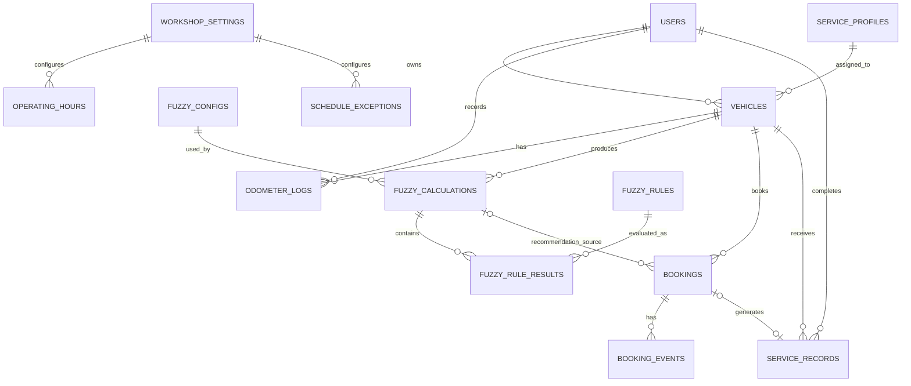

# Database Specification

## Sistem Informasi Bengkel & Penjadwalan Servis Rutin dengan Fuzzy Tsukamoto

**Document Version:** 1.0  
**Status:** Locked Baseline  
**Database Engine:** MySQL  
**Framework:** Laravel / Eloquent ORM  
**Related Document:** `PRD.md`

---

## 1. Tujuan Dokumen

Dokumen ini mendefinisikan desain database untuk aplikasi Sistem Informasi Bengkel dan Penjadwalan Servis Rutin dengan Fuzzy Tsukamoto.

Database harus mendukung core flow berikut:

```text
Customer
  ↓
Vehicle
  ↓
Odometer History
  ↓
Fuzzy Calculation
  ↓
Service Recommendation
  ↓
Booking
  ↓
Service
  ↓
Service History
  ↓
Vehicle Baseline Updated
  ↓
Next Recommendation Cycle
```

Desain database diprioritaskan agar:

- mudah dipahami oleh developer dan pemilik tugas akhir,
- cukup ter-normalisasi tanpa overengineering,
- menjaga histori perhitungan fuzzy,
- menjaga histori booking dan servis,
- mendukung audit sederhana,
- aman terhadap inkonsistensi data,
- dapat diimplementasikan dengan Laravel migrations dan Eloquent.

---

# 2. Prinsip Database

## 2.1 Satu Laravel Application, Satu Database

Aplikasi menggunakan satu database MySQL untuk seluruh domain aplikasi.

Tidak menggunakan database terpisah untuk fuzzy, microservice database, atau NoSQL.

## 2.2 Historical Data Tidak Boleh Hilang

Data berikut bersifat historis dan tidak boleh dihapus melalui workflow normal:

- odometer logs,
- fuzzy calculations,
- fuzzy rule results,
- bookings,
- booking events,
- service records.

Cancellation atau correction dilakukan melalui status/history, bukan hard delete.

## 2.3 Soft Delete

Soft delete digunakan pada:

- users,
- vehicles,
- service_profiles.

## 2.4 Snapshot Fuzzy

`fuzzy_calculations` menyimpan snapshot input, membership, konfigurasi, hasil rule, dan rekomendasi agar kalkulasi lama tetap dapat dijelaskan walaupun konfigurasi atau service profile berubah.

---

# 3. Konvensi

## 3.1 Primary Key

Semua domain table menggunakan:

```text
BIGINT UNSIGNED AUTO_INCREMENT
```

Laravel:

```php
$table->id();
```

## 3.2 Timestamp

Gunakan Laravel timestamps untuk:

```text
created_at
updated_at
```

Timestamp bisnis disimpan terpisah, misalnya:

```text
recorded_at
calculated_at
scheduled_at
service_date
```

## 3.3 Timezone

Default:

```text
Asia/Jakarta
```

## 3.4 Decimal

Nilai fuzzy menggunakan `DECIMAL`, bukan floating point database.

Rekomendasi:

```text
membership / alpha / z / progress : DECIMAL(8,4)
score                              : DECIMAL(5,2)
currency                           : DECIMAL(12,2)
```

---

# 4. Daftar Tabel Domain

| No | Table | Fungsi |
|---:|---|---|
| 1 | `users` | Customer dan admin |
| 2 | `service_profiles` | Interval dasar servis |
| 3 | `vehicles` | Kendaraan customer |
| 4 | `odometer_logs` | Histori kilometer |
| 5 | `fuzzy_configs` | Konfigurasi versioned fuzzy |
| 6 | `fuzzy_rules` | 18 rule Fuzzy Tsukamoto |
| 7 | `fuzzy_calculations` | Snapshot kalkulasi |
| 8 | `fuzzy_rule_results` | Alpha dan z rule aktif |
| 9 | `bookings` | Booking servis |
| 10 | `booking_events` | Timeline booking |
| 11 | `service_records` | Riwayat servis |
| 12 | `workshop_settings` | Pengaturan bengkel |
| 13 | `operating_hours` | Jam operasional |
| 14 | `schedule_exceptions` | Hari libur/jam khusus |

Laravel technical tables jika dibutuhkan:

- `notifications`
- `jobs`
- `job_batches`
- `failed_jobs`
- `sessions`
- `password_reset_tokens`

---

# 5. ERD Overview



---

# 6. Table: `users`

## Tujuan

Menyimpan customer dan admin. Tidak ada tabel role/permission terpisah karena MVP hanya memiliki dua role tetap.

| Column | Type | Nullable | Constraint / Default | Keterangan |
|---|---|---:|---|---|
| `id` | BIGINT UNSIGNED | No | PK | |
| `name` | VARCHAR(150) | No | | Nama lengkap |
| `email` | VARCHAR(255) | No | UNIQUE | Login |
| `phone` | VARCHAR(30) | No | | Nomor HP |
| `password` | VARCHAR(255) | No | | Password hash |
| `role` | VARCHAR(20) | No | `customer` | customer/admin |
| `email_verified_at` | TIMESTAMP | Yes | | |
| `remember_token` | VARCHAR(100) | Yes | | |
| `created_at` | TIMESTAMP | Yes | | |
| `updated_at` | TIMESTAMP | Yes | | |
| `deleted_at` | TIMESTAMP | Yes | | Soft delete |

Application enum:

```php
enum UserRole: string
{
    case Customer = 'customer';
    case Admin = 'admin';
}
```

Indexes:

```text
UNIQUE(email)
INDEX(role)
INDEX(deleted_at)
```

---

# 7. Table: `service_profiles`

## Tujuan

Menyimpan interval dasar servis. Interval bukan hasil fuzzy; fuzzy hanya menentukan urgensi berdasarkan progress terhadap interval.

| Column | Type | Nullable | Constraint | Keterangan |
|---|---|---:|---|---|
| `id` | BIGINT UNSIGNED | No | PK | |
| `name` | VARCHAR(150) | No | | Nama profile |
| `interval_km` | INT UNSIGNED | No | > 0 | Interval kilometer |
| `interval_days` | INT UNSIGNED | No | > 0 | Interval hari |
| `description` | TEXT | Yes | | |
| `is_active` | BOOLEAN | No | default true | |
| `created_at` | TIMESTAMP | Yes | | |
| `updated_at` | TIMESTAMP | Yes | | |
| `deleted_at` | TIMESTAMP | Yes | | Soft delete |

Contoh:

```text
Servis Rutin Standar
interval_km   = 4000
interval_days = 120
```

Indexes:

```text
INDEX(is_active)
INDEX(deleted_at)
```

---

# 8. Table: `vehicles`

## Tujuan

Menyimpan kendaraan customer dan baseline siklus servis aktif.

| Column | Type | Nullable | Constraint | Keterangan |
|---|---|---:|---|---|
| `id` | BIGINT UNSIGNED | No | PK | |
| `user_id` | BIGINT UNSIGNED | No | FK users | Pemilik |
| `service_profile_id` | BIGINT UNSIGNED | No | FK service_profiles | Profile aktif |
| `name` | VARCHAR(100) | No | | Nama personal |
| `plate_number` | VARCHAR(30) | No | | Tampilan plat |
| `plate_number_normalized` | VARCHAR(30) | No | UNIQUE | Search/uniqueness |
| `brand` | VARCHAR(100) | No | | |
| `model` | VARCHAR(120) | No | | |
| `year` | SMALLINT UNSIGNED | No | | |
| `baseline_service_date` | DATE | Yes | | Servis acuan |
| `baseline_odometer` | INT UNSIGNED | Yes | | KM servis acuan |
| `baseline_source` | VARCHAR(30) | Yes | | Sumber baseline |
| `baseline_service_record_id` | BIGINT UNSIGNED | Yes | FK service_records | Record sumber |
| `created_at` | TIMESTAMP | Yes | | |
| `updated_at` | TIMESTAMP | Yes | | |
| `deleted_at` | TIMESTAMP | Yes | | Soft delete |

Baseline source:

```php
enum BaselineSource: string
{
    case CustomerInput = 'customer_input';
    case ServiceRecord = 'service_record';
    case AdminCorrection = 'admin_correction';
}
```

Recommendation hanya tersedia jika ada:

```text
baseline_service_date
baseline_odometer
service_profile
latest odometer
```

Plate normalization:

```text
F 1234 ABC
→ F1234ABC
```

Indexes:

```text
UNIQUE(plate_number_normalized)
INDEX(user_id)
INDEX(service_profile_id)
INDEX(baseline_service_record_id)
INDEX(deleted_at)
```

---

# 9. Table: `odometer_logs`

## Tujuan

Menjadi source of truth histori kilometer dan dasar intensitas penggunaan.

`vehicles` tidak menyimpan current odometer terpisah; odometer terkini berasal dari log terbaru.

| Column | Type | Nullable | Keterangan |
|---|---|---:|---|
| `id` | BIGINT UNSIGNED | No | PK |
| `vehicle_id` | BIGINT UNSIGNED | No | FK vehicles |
| `odometer` | INT UNSIGNED | No | Kilometer |
| `recorded_at` | DATETIME | No | Tanggal/waktu pencatatan |
| `source` | VARCHAR(30) | No | Sumber |
| `recorded_by` | BIGINT UNSIGNED | Yes | FK users |
| `correction_reason` | TEXT | Yes | Alasan koreksi |
| `created_at` | TIMESTAMP | Yes | |
| `updated_at` | TIMESTAMP | Yes | |

Source:

```php
enum OdometerSource: string
{
    case Initial = 'initial';
    case CustomerUpdate = 'customer_update';
    case Service = 'service';
    case AdminCorrection = 'admin_correction';
}
```

Validation:

```text
new_odometer >= latest_valid_odometer
```

Untuk koreksi, direkomendasikan membuat entry `admin_correction` baru dengan alasan, bukan menghapus histori.

Indexes:

```text
INDEX(vehicle_id, recorded_at)
INDEX(recorded_by)
INDEX(source)
```

---

# 10. Table: `fuzzy_configs`

## Tujuan

Menyimpan parameter membership secara versioned.

Perubahan konfigurasi membuat version baru; histori kalkulasi lama tetap menunjuk config lama.

| Column | Type | Nullable | Default | Keterangan |
|---|---|---:|---:|---|
| `id` | BIGINT UNSIGNED | No | | PK |
| `version` | INT UNSIGNED | No | | UNIQUE |
| `progress_safe_end` | DECIMAL(6,2) | No | 70 | Batas aman |
| `progress_approaching_peak` | DECIMAL(6,2) | No | 90 | Puncak mendekati |
| `progress_critical_full` | DECIMAL(6,2) | No | 100 | Kritis penuh |
| `usage_normal_full_until` | DECIMAL(6,2) | No | 80 | Normal penuh |
| `usage_intensive_full_from` | DECIMAL(6,2) | No | 120 | Intensif penuh |
| `is_active` | BOOLEAN | No | false | |
| `created_by` | BIGINT UNSIGNED | Yes | | FK users |
| `created_at` | TIMESTAMP | Yes | | |
| `updated_at` | TIMESTAMP | Yes | | |

Validation:

```text
progress_safe_end < progress_approaching_peak < progress_critical_full
usage_normal_full_until < usage_intensive_full_from
```

Application memastikan hanya satu config aktif.

Indexes:

```text
UNIQUE(version)
INDEX(is_active)
INDEX(created_by)
```

---

# 11. Table: `fuzzy_rules`

## Tujuan

Menyimpan 18 rule locked. Admin hanya dapat melihat, tidak mengedit.

| Column | Type | Nullable | Constraint | Keterangan |
|---|---|---:|---|---|
| `id` | BIGINT UNSIGNED | No | PK | |
| `code` | VARCHAR(10) | No | UNIQUE | R01–R18 |
| `km_state` | VARCHAR(20) | No | | safe/approaching/critical |
| `time_state` | VARCHAR(20) | No | | safe/approaching/critical |
| `usage_state` | VARCHAR(20) | No | | normal/intensive |
| `consequent` | VARCHAR(20) | No | | not_urgent/urgent |
| `description` | TEXT | Yes | | |
| `created_at` | TIMESTAMP | Yes | | |
| `updated_at` | TIMESTAMP | Yes | | |

Locked rule set:

| Code | KM | Time | Usage | Consequent |
|---|---|---|---|---|
| R01 | safe | safe | normal | not_urgent |
| R02 | safe | safe | intensive | not_urgent |
| R03 | safe | approaching | normal | not_urgent |
| R04 | safe | approaching | intensive | urgent |
| R05 | safe | critical | normal | urgent |
| R06 | safe | critical | intensive | urgent |
| R07 | approaching | safe | normal | not_urgent |
| R08 | approaching | safe | intensive | urgent |
| R09 | approaching | approaching | normal | urgent |
| R10 | approaching | approaching | intensive | urgent |
| R11 | approaching | critical | normal | urgent |
| R12 | approaching | critical | intensive | urgent |
| R13 | critical | safe | normal | urgent |
| R14 | critical | safe | intensive | urgent |
| R15 | critical | approaching | normal | urgent |
| R16 | critical | approaching | intensive | urgent |
| R17 | critical | critical | normal | urgent |
| R18 | critical | critical | intensive | urgent |

Seed menggunakan `FuzzyRuleSeeder` dan idempotent berdasarkan `code`.

---

# 12. Table: `fuzzy_calculations`

## Tujuan

Snapshot lengkap satu kalkulasi fuzzy dan recommendation layer.

### Identity

| Column | Type | Nullable |
|---|---|---:|
| `id` | BIGINT UNSIGNED | No |
| `vehicle_id` | BIGINT UNSIGNED | No |
| `fuzzy_config_id` | BIGINT UNSIGNED | No |
| `trigger_type` | VARCHAR(40) | No |

### Service Profile Snapshot

| Column | Type | Nullable |
|---|---|---:|
| `interval_km_snapshot` | INT UNSIGNED | No |
| `interval_days_snapshot` | INT UNSIGNED | No |

### Input Snapshot

| Column | Type | Nullable |
|---|---|---:|
| `current_odometer` | INT UNSIGNED | No |
| `baseline_odometer` | INT UNSIGNED | No |
| `baseline_service_date` | DATE | No |
| `km_since_service` | INT UNSIGNED | No |
| `days_since_service` | INT UNSIGNED | No |
| `average_daily_km` | DECIMAL(10,2) | Yes |
| `baseline_daily_usage` | DECIMAL(10,2) | No |
| `progress_km` | DECIMAL(8,2) | No |
| `progress_time` | DECIMAL(8,2) | No |
| `usage_intensity` | DECIMAL(8,2) | Yes |

### Membership Snapshot

| Column | Type | Nullable |
|---|---|---:|
| `km_safe_mu` | DECIMAL(8,4) | No |
| `km_approaching_mu` | DECIMAL(8,4) | No |
| `km_critical_mu` | DECIMAL(8,4) | No |
| `time_safe_mu` | DECIMAL(8,4) | No |
| `time_approaching_mu` | DECIMAL(8,4) | No |
| `time_critical_mu` | DECIMAL(8,4) | No |
| `usage_normal_mu` | DECIMAL(8,4) | Yes |
| `usage_intensive_mu` | DECIMAL(8,4) | Yes |

### Fuzzy Result

| Column | Type | Nullable |
|---|---|---:|
| `score` | DECIMAL(5,2) | No |
| `fuzzy_status` | VARCHAR(30) | No |

### Recommendation / Projection

| Column | Type | Nullable |
|---|---|---:|
| `estimated_due_by_km` | DATE | Yes |
| `estimated_due_by_time` | DATE | No |
| `estimated_due_date` | DATE | No |
| `recommended_from_date` | DATE | Yes |
| `recommended_to_date` | DATE | Yes |
| `recommended_date` | DATE | No |
| `final_status` | VARCHAR(30) | No |
| `guard_applied` | BOOLEAN | No |
| `guard_reason` | TEXT | Yes |
| `calculated_at` | DATETIME | No |
| `created_at` | TIMESTAMP | Yes |
| `updated_at` | TIMESTAMP | Yes |

Trigger enum:

```php
enum CalculationTrigger: string
{
    case VehicleCreated = 'vehicle_created';
    case OdometerUpdated = 'odometer_updated';
    case DailyScheduler = 'daily_scheduler';
    case ServiceCompleted = 'service_completed';
    case ServiceProfileChanged = 'service_profile_changed';
    case FuzzyConfigChanged = 'fuzzy_config_changed';
    case ManualRecalculate = 'manual_recalculate';
}
```

Recommendation status:

```php
enum RecommendationStatus: string
{
    case NotNeeded = 'not_needed';
    case Approaching = 'approaching';
    case Urgent = 'urgent';
    case Unavailable = 'unavailable';
}
```

Score mapping:

```text
0.00 – <40.00  = not_needed
40.00 – <70.00 = approaching
70.00 – 100.00 = urgent
```

`unavailable` tidak perlu membuat fuzzy calculation bila input wajib belum lengkap.

Indexes:

```text
INDEX(vehicle_id, calculated_at)
INDEX(fuzzy_config_id)
INDEX(trigger_type)
INDEX(final_status)
INDEX(calculated_at)
```

Current recommendation = latest calculation untuk vehicle.

Tidak ada tabel `recommendations`.

---

# 13. Table: `fuzzy_rule_results`

## Tujuan

Menyimpan rule aktif pada satu kalkulasi.

| Column | Type | Nullable | Keterangan |
|---|---|---:|---|
| `id` | BIGINT UNSIGNED | No | PK |
| `fuzzy_calculation_id` | BIGINT UNSIGNED | No | FK |
| `fuzzy_rule_id` | BIGINT UNSIGNED | No | FK |
| `alpha` | DECIMAL(8,4) | No | 0–1 |
| `z_value` | DECIMAL(8,4) | No | Nilai z |
| `weighted_value` | DECIMAL(12,4) | No | alpha × z |
| `created_at` | TIMESTAMP | Yes | |
| `updated_at` | TIMESTAMP | Yes | |

Constraints:

```text
UNIQUE(fuzzy_calculation_id, fuzzy_rule_id)
INDEX(fuzzy_calculation_id)
INDEX(fuzzy_rule_id)
```

Rule dengan alpha 0 tidak perlu disimpan.

---

# 14. Table: `bookings`

## Tujuan

Menyimpan janji servis, bukan hasil servis.

| Column | Type | Nullable | Constraint |
|---|---|---:|---|
| `id` | BIGINT UNSIGNED | No | PK |
| `booking_code` | VARCHAR(30) | No | UNIQUE |
| `vehicle_id` | BIGINT UNSIGNED | No | FK vehicles |
| `recommendation_calculation_id` | BIGINT UNSIGNED | Yes | FK fuzzy_calculations |
| `scheduled_at` | DATETIME | No | |
| `duration_minutes` | SMALLINT UNSIGNED | No | |
| `status` | VARCHAR(30) | No | |
| `complaint` | TEXT | Yes | |
| `cancellation_reason` | TEXT | Yes | |
| `created_at` | TIMESTAMP | Yes | |
| `updated_at` | TIMESTAMP | Yes | |

Status:

```php
enum BookingStatus: string
{
    case Pending = 'pending';
    case Confirmed = 'confirmed';
    case InService = 'in_service';
    case Completed = 'completed';
    case Cancelled = 'cancelled';
}
```

Valid transitions:

```text
Pending
├─→ Confirmed
└─→ Cancelled

Confirmed
├─→ In Service
└─→ Cancelled

In Service
└─→ Completed
```

Status yang memakai slot capacity:

```text
pending
confirmed
in_service
```

Indexes:

```text
UNIQUE(booking_code)
INDEX(vehicle_id)
INDEX(recommendation_calculation_id)
INDEX(scheduled_at)
INDEX(status)
INDEX(scheduled_at, status)
```

---

# 15. Table: `booking_events`

## Tujuan

Timeline perubahan booking.

| Column | Type | Nullable |
|---|---|---:|
| `id` | BIGINT UNSIGNED | No |
| `booking_id` | BIGINT UNSIGNED | No |
| `event_type` | VARCHAR(30) | No |
| `actor_user_id` | BIGINT UNSIGNED | Yes |
| `old_status` | VARCHAR(30) | Yes |
| `new_status` | VARCHAR(30) | Yes |
| `old_scheduled_at` | DATETIME | Yes |
| `new_scheduled_at` | DATETIME | Yes |
| `note` | TEXT | Yes |
| `created_at` | TIMESTAMP | Yes |
| `updated_at` | TIMESTAMP | Yes |

Event enum:

```php
enum BookingEventType: string
{
    case Created = 'created';
    case Confirmed = 'confirmed';
    case Rescheduled = 'rescheduled';
    case Started = 'started';
    case Completed = 'completed';
    case Cancelled = 'cancelled';
}
```

Indexes:

```text
INDEX(booking_id, created_at)
INDEX(actor_user_id)
INDEX(event_type)
```

---

# 16. Table: `service_records`

## Tujuan

Menyimpan servis yang benar-benar telah dilakukan.

| Column | Type | Nullable | Constraint |
|---|---|---:|---|
| `id` | BIGINT UNSIGNED | No | PK |
| `service_code` | VARCHAR(30) | No | UNIQUE |
| `vehicle_id` | BIGINT UNSIGNED | No | FK vehicles |
| `booking_id` | BIGINT UNSIGNED | Yes | UNIQUE FK bookings |
| `service_date` | DATETIME | No | |
| `odometer` | INT UNSIGNED | No | |
| `service_type` | VARCHAR(100) | No | |
| `complaint` | TEXT | Yes | |
| `work_performed` | TEXT | No | |
| `notes` | TEXT | Yes | |
| `total_cost` | DECIMAL(12,2) | No | >=0 |
| `completed_by` | BIGINT UNSIGNED | No | FK users |
| `correction_reason` | TEXT | Yes | |
| `created_at` | TIMESTAMP | Yes | |
| `updated_at` | TIMESTAMP | Yes | |

`booking_id` nullable supaya schema tidak menutup kemungkinan future walk-in service, tetapi MVP tetap berfokus pada booking.

Indexes:

```text
UNIQUE(service_code)
UNIQUE(booking_id)
INDEX(vehicle_id, service_date)
INDEX(completed_by)
INDEX(service_date)
```

---

# 17. Table: `workshop_settings`

## Tujuan

Singleton settings untuk satu bengkel.

| Column | Type | Nullable | Default |
|---|---|---:|---|
| `id` | BIGINT UNSIGNED | No | |
| `workshop_name` | VARCHAR(150) | No | |
| `address` | TEXT | No | |
| `phone` | VARCHAR(30) | No | |
| `email` | VARCHAR(255) | Yes | |
| `timezone` | VARCHAR(50) | No | Asia/Jakarta |
| `slot_duration_minutes` | SMALLINT UNSIGNED | No | 60 |
| `slot_capacity` | SMALLINT UNSIGNED | No | sesuai bengkel |
| `created_at` | TIMESTAMP | Yes | |
| `updated_at` | TIMESTAMP | Yes | |

Application memastikan satu record digunakan sebagai setting aktif.

---

# 18. Table: `operating_hours`

## Tujuan

Jam buka reguler per hari.

| Column | Type | Nullable |
|---|---|---:|
| `id` | BIGINT UNSIGNED | No |
| `workshop_setting_id` | BIGINT UNSIGNED | No |
| `day_of_week` | TINYINT UNSIGNED | No |
| `is_open` | BOOLEAN | No |
| `open_time` | TIME | Yes |
| `close_time` | TIME | Yes |
| `created_at` | TIMESTAMP | Yes |
| `updated_at` | TIMESTAMP | Yes |

Convention:

```text
1 Monday
2 Tuesday
3 Wednesday
4 Thursday
5 Friday
6 Saturday
7 Sunday
```

Constraint:

```text
UNIQUE(workshop_setting_id, day_of_week)
```

---

# 19. Table: `schedule_exceptions`

## Tujuan

Override jam reguler pada tanggal tertentu.

| Column | Type | Nullable |
|---|---|---:|
| `id` | BIGINT UNSIGNED | No |
| `workshop_setting_id` | BIGINT UNSIGNED | No |
| `date` | DATE | No |
| `is_closed` | BOOLEAN | No |
| `open_time` | TIME | Yes |
| `close_time` | TIME | Yes |
| `reason` | VARCHAR(255) | Yes |
| `created_at` | TIMESTAMP | Yes |
| `updated_at` | TIMESTAMP | Yes |

Constraint:

```text
UNIQUE(workshop_setting_id, date)
```

---

# 20. Laravel Notifications

Gunakan tabel notifications bawaan Laravel.

Contoh payload:

```json
{
  "title": "Servis kendaraan mulai mendekat",
  "message": "Honda Vario 160 disarankan melakukan servis.",
  "vehicle_id": 12,
  "fuzzy_calculation_id": 251
}
```

Tidak diperlukan notification domain table custom.

---

# 21. Database Transactions

## 21.1 Create Vehicle

```text
BEGIN

Create Vehicle
Create initial OdometerLog

Jika baseline lengkap:
    Calculate recommendation
    Create FuzzyCalculation
    Create FuzzyRuleResults

COMMIT
```

## 21.2 Update Odometer

```text
BEGIN

Re-check latest odometer
Validate new odometer
Create OdometerLog
Calculate recommendation
Create FuzzyCalculation
Create FuzzyRuleResults

COMMIT
```

Notification setelah commit.

## 21.3 Create Booking

```text
BEGIN

Re-check operating hours
Re-check schedule exception
Re-check slot capacity
Create Booking
Create BookingEvent(created)

COMMIT
```

## 21.4 Complete Service

```text
BEGIN

Validate booking = in_service
Validate service odometer

Create ServiceRecord
Create OdometerLog(source=service)

Update Vehicle:
    baseline_service_date
    baseline_odometer
    baseline_source = service_record
    baseline_service_record_id

Update Booking(status=completed)
Create BookingEvent(completed)

Calculate new recommendation
Create FuzzyCalculation
Create FuzzyRuleResults

COMMIT
```

Jika salah satu gagal:

```text
ROLLBACK
```

## 21.5 Change Fuzzy Config

```text
BEGIN

Deactivate current config
Create new version
Activate new version

COMMIT
```

Historical calculation tetap menunjuk config lama.

---

# 22. Booking Availability

Tidak ada tabel booking slots.

Slot dihasilkan dari:

```text
operating_hours
+
schedule_exceptions
+
slot_duration_minutes
```

Capacity check:

```sql
SELECT COUNT(*)
FROM bookings
WHERE scheduled_at = ?
  AND status IN ('pending', 'confirmed', 'in_service');
```

Available jika:

```text
count < slot_capacity
```

Server wajib mengecek ulang saat insert untuk mencegah race condition.

---

# 23. Average Daily Usage

Sumber:

```text
odometer_logs
```

Konsep:

```text
average_daily_km =
odometer_delta / day_delta
```

Disarankan menggunakan histori relevan sejak baseline servis atau window yang ditentukan konsisten oleh `UsageCalculator`.

Jika data belum cukup:

```text
average_daily_km = null
usage_intensity = null
```

Sistem harus memakai fallback deterministic yang didokumentasikan di implementation, bukan mengarang usage value.

---

# 24. Delete Strategy

| Entity | Strategy |
|---|---|
| users | Soft delete |
| vehicles | Soft delete |
| service_profiles | Soft delete |
| odometer_logs | Tidak dihapus normal |
| fuzzy_configs | Tidak dihapus normal |
| fuzzy_rules | Locked seed data |
| fuzzy_calculations | Tidak dihapus normal |
| fuzzy_rule_results | Mengikuti calculation |
| bookings | Status cancelled, bukan delete |
| booking_events | Tidak dihapus normal |
| service_records | Tidak dihapus normal |
| operating_hours | Dapat diedit |
| schedule_exceptions | Dapat dikelola admin |

---

# 25. Foreign Key Strategy

Recommended:

| Relation | Delete Behavior |
|---|---|
| vehicles → users | RESTRICT / soft-delete workflow |
| vehicles → service_profiles | RESTRICT |
| odometer_logs → vehicles | RESTRICT |
| odometer_logs → users | SET NULL |
| fuzzy_calculations → vehicles | RESTRICT |
| fuzzy_calculations → fuzzy_configs | RESTRICT |
| fuzzy_rule_results → fuzzy_calculations | CASCADE jika parent dipurge manual |
| fuzzy_rule_results → fuzzy_rules | RESTRICT |
| bookings → vehicles | RESTRICT |
| bookings → fuzzy_calculations | SET NULL |
| booking_events → bookings | CASCADE hanya jika manual purge |
| booking_events → users | SET NULL |
| service_records → vehicles | RESTRICT |
| service_records → bookings | SET NULL |
| service_records → users | RESTRICT |
| operating_hours → workshop_settings | CASCADE |
| schedule_exceptions → workshop_settings | CASCADE |

Normal production workflow tidak menghapus historical parent entity.

---

# 26. Human-Readable Codes

Database PK tetap integer.

Customer-facing codes:

```text
BK-2026-0021
SRV-2026-0015
```

Fields:

```text
bookings.booking_code
service_records.service_code
```

Human code bukan primary key.

---

# 27. Suggested Eloquent Relationships

## User

```text
hasMany(Vehicle)
hasMany(OdometerLog, recorded_by)
hasMany(ServiceRecord, completed_by)
hasMany(BookingEvent, actor_user_id)
```

## Vehicle

```text
belongsTo(User)
belongsTo(ServiceProfile)
belongsTo(ServiceRecord, baseline_service_record_id)

hasMany(OdometerLog)
hasMany(FuzzyCalculation)
hasMany(Booking)
hasMany(ServiceRecord)
```

## FuzzyCalculation

```text
belongsTo(Vehicle)
belongsTo(FuzzyConfig)
hasMany(FuzzyRuleResult)
hasMany(Booking, recommendation_calculation_id)
```

## Booking

```text
belongsTo(Vehicle)
belongsTo(FuzzyCalculation, recommendation_calculation_id)
hasMany(BookingEvent)
hasOne(ServiceRecord)
```

## ServiceRecord

```text
belongsTo(Vehicle)
belongsTo(Booking)
belongsTo(User, completed_by)
```

---

# 28. Model Casts

Recommended enum/datetime casts:

```text
User.role → UserRole
Vehicle.baseline_source → BaselineSource
OdometerLog.source → OdometerSource
Booking.status → BookingStatus
FuzzyCalculation.trigger_type → CalculationTrigger
FuzzyCalculation.fuzzy_status → RecommendationStatus
FuzzyCalculation.final_status → RecommendationStatus
```

Dates:

```text
baseline_service_date → date
recorded_at → datetime
scheduled_at → datetime
service_date → datetime
calculated_at → datetime
recommended_date → date
```

---

# 29. Migration Order

Recommended:

```text
01 users
02 service_profiles
03 workshop_settings
04 operating_hours
05 schedule_exceptions
06 vehicles
07 odometer_logs
08 fuzzy_configs
09 fuzzy_rules
10 fuzzy_calculations
11 fuzzy_rule_results
12 bookings
13 booking_events
14 service_records
15 add baseline_service_record_id FK to vehicles
16 Laravel technical tables
```

`vehicles.baseline_service_record_id` menimbulkan circular dependency, sehingga foreign key ditambahkan setelah `service_records` tersedia.

---

# 30. Seeder Plan

Minimum:

```text
AdminUserSeeder
ServiceProfileSeeder
FuzzyConfigSeeder
FuzzyRuleSeeder
WorkshopSettingSeeder
OperatingHourSeeder
```

Development/demo optional:

```text
DemoCustomerSeeder
DemoVehicleSeeder
DemoBookingSeeder
DemoServiceHistorySeeder
```

Production tidak boleh memuat demo data.

---

# 31. Factory Plan

```text
UserFactory
VehicleFactory
ServiceProfileFactory
OdometerLogFactory
FuzzyConfigFactory
FuzzyCalculationFactory
BookingFactory
ServiceRecordFactory
```

Canonical fuzzy rules berasal dari seeder, bukan random factory.

---

# 32. Data Integrity Rules

## Vehicle

```text
year valid
baseline_odometer >= 0
```

## Odometer

```text
odometer >= 0
new_odometer >= latest_valid_odometer
```

## Service Profile

```text
interval_km > 0
interval_days > 0
```

## Fuzzy

```text
membership in [0,1]
alpha in [0,1]
score in [0,100]
```

## Booking

```text
scheduled_at di jam operasional
slot tersedia
state transition valid
```

## Service

```text
odometer >= latest odometer
total_cost >= 0
booking status = in_service
```

---

# 33. Query Optimization

## Customer Dashboard

Load:

```text
customer vehicles
latest odometer
latest fuzzy calculation
active booking
```

Gunakan eager loading dan latest-of-many relation untuk mencegah N+1.

## Admin Dashboard

Indexes utama:

```text
bookings.scheduled_at
bookings.status
fuzzy_calculations.final_status
```

## Service History

Gunakan:

```text
INDEX(vehicle_id, service_date)
INDEX(service_date)
```

---

# 34. Reporting

Tidak ada tabel reports.

Report berasal dari query:

### Total Booking

```text
COUNT(bookings)
WHERE scheduled_at BETWEEN start AND end
```

### Completed Services

```text
COUNT(service_records)
WHERE service_date BETWEEN start AND end
```

### Revenue

```text
SUM(service_records.total_cost)
WHERE service_date BETWEEN start AND end
```

### Unique Customers

```text
COUNT(DISTINCT vehicles.user_id)
JOIN service_records
```

---

# 35. Tables yang Sengaja Tidak Dibuat

Tidak dibuat:

- `roles`
- `permissions`
- `recommendations`
- `booking_slots`
- `reports`
- `technicians`
- `inventory`
- `spare_parts`
- `payments`
- `workshops`
- `branches`

Alasan: tidak diperlukan untuk scope MVP.

---

# 36. Example End-to-End Data Flow

Customer:

```text
Rizky
```

Kendaraan:

```text
Honda Vario 160
F 1234 ABC
```

## Step 1 — User

```text
users
id = 10
role = customer
```

## Step 2 — Vehicle

```text
vehicles
id = 15
user_id = 10
service_profile_id = 1
baseline_service_date = 2026-06-01
baseline_odometer = 10000
baseline_source = customer_input
```

## Step 3 — Initial Odometer

```text
odometer_logs
vehicle_id = 15
odometer = 13200
source = initial
```

## Step 4 — Fuzzy

```text
fuzzy_calculations
vehicle_id = 15
progress_km = 80.00
score = ...
```

Rule aktif:

```text
fuzzy_rule_results
```

## Step 5 — Update Odometer

```text
13550 km
```

Membuat log baru dan kalkulasi baru.

## Step 6 — Booking

```text
bookings
booking_code = BK-2026-0021
vehicle_id = 15
status = confirmed
```

## Step 7 — Service

Admin menyelesaikan servis pada:

```text
13800 km
```

Sistem membuat:

```text
service_records
odometer_logs(source=service)
booking_events(completed)
```

Vehicle baseline menjadi:

```text
baseline_service_date = tanggal servis
baseline_odometer = 13800
baseline_source = service_record
```

Recommendation dihitung ulang untuk siklus berikutnya.

---

# 37. Database Testing Requirements

Wajib menguji:

## Ownership

```text
Customer A tidak dapat mengakses Vehicle B
Customer A tidak dapat mengakses Booking B
```

## Odometer

```text
odometer lebih kecil ditolak
odometer valid diterima
```

## Fuzzy Persistence

```text
config version tersimpan
input snapshot tersimpan
membership snapshot tersimpan
active rules tersimpan
score tersimpan
```

## Booking

```text
slot penuh ditolak
hari tutup ditolak
cancelled booking melepaskan kapasitas
```

## Complete Service

```text
service record dibuat
odometer log dibuat
baseline berubah
booking completed
new fuzzy calculation dibuat
rollback jika salah satu operasi gagal
```

---

# 38. Definition of Done — Database

Database dianggap siap ketika:

- migration dapat dijalankan dari database kosong,
- migration dapat rollback pada development,
- foreign key valid,
- index utama tersedia,
- canonical seeders berhasil,
- seluruh 18 fuzzy rules tersimpan benar,
- hanya satu fuzzy config aktif,
- service completion bersifat transactional,
- booking availability terlindungi dari overbooking,
- historical fuzzy calculation dapat direproduksi,
- tidak ada duplicate source of truth yang tidak diperlukan,
- automated test untuk critical flow lulus.

---

# 39. Final Database Principle

Setiap tabel hanya menyimpan data yang memiliki tanggung jawab jelas:

```text
users
→ siapa pengguna

vehicles
→ kendaraan siapa

service_profiles
→ interval servis apa

odometer_logs
→ bagaimana kendaraan digunakan

fuzzy_configs
→ konfigurasi fuzzy versi berapa

fuzzy_rules
→ aturan keputusan apa

fuzzy_calculations
→ input dan hasil fuzzy

fuzzy_rule_results
→ rule mana yang aktif

bookings
→ kapan customer berencana servis

booking_events
→ apa yang terjadi pada booking

service_records
→ servis apa yang benar-benar dilakukan

workshop_settings
operating_hours
schedule_exceptions
→ kapan bengkel dapat menerima booking
```

Jika sebuah data tidak memiliki alasan bisnis atau teknis yang jelas, data tersebut tidak perlu ditambahkan ke schema MVP.
